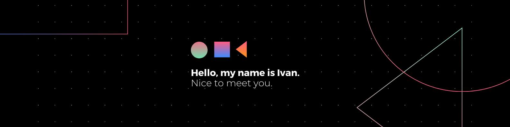

<!-- <h2>
Undergraduate, Nanyang Technological University
</h2> -->
## Introduction
Hello, I am Ivan, an undergraduate in Computer Science at [Nanyang Technological University](https://www.ntu.edu.sg/). I enjoy the process of designing and developing applications. I love the challenge of solving problems with the aid of programming. It is a marvel to see what the power of computing beholds!
 

---

### ✏️ Technical Skills:

### 💻 Operating systems:

---

### 💪 Stats

---

### 🤝 Connect With Me:
<bn/>

 
 
